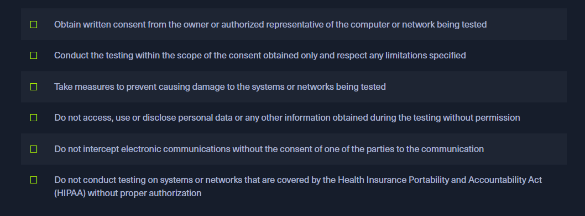

## PENETRATION TESTING PROCESS  

## Types of Penetration Testing

## Types of Testing Environments

## Requirements

> Le premier rapport remis au client est le : DRAFT puis le FINAL

## Methodology of learning in HTB Academy CPTS path

* 2x Modules
* 3x Retired Machines
* 5x Active Machines
* 1x Pro Lab / Endgame

## Advices

 some advices - quotes of the HackTheBox team
 

