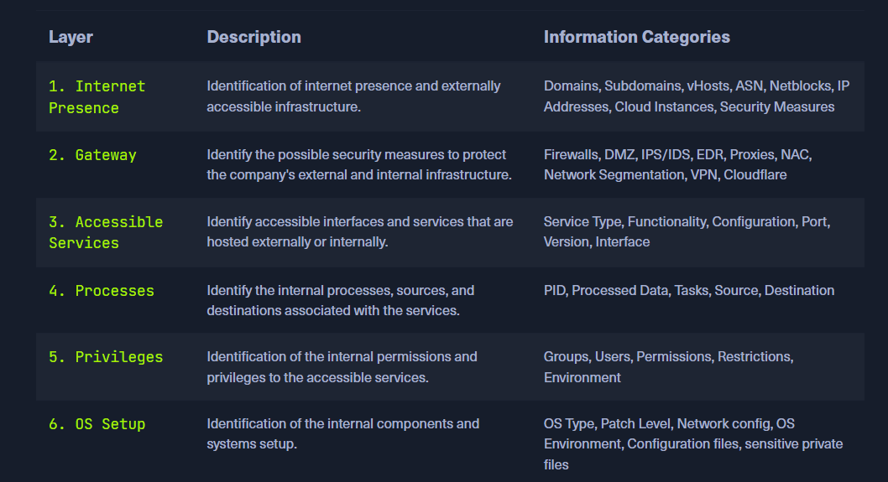

# Footprinting

## Principes d'énumération

### Questions 
* What can we see?
* What reasons can we have for seeing it?
* What image does what we see create for us?
* What do we gain from it?
* How can we use it?
* What can we not see?
* What reasons can there be that we do not see?
* What image results for us from what we do not see?

### Principes

| **PRINCIPES** |
|---|
|There is more than meets the eye. Consider all points of view.|
|Distinguish between what we see and what we do not see.|
|There are always ways to gain more information. Understand the target.|


**`Another advantage of these principles is that we can see from the practical tasks that we do not lack penetration testing abilities but technical understanding when we suddenly do not know how to proceed because our core task is not to exploit the machines but to find how they can be exploited.`**


**Enumeration Layers**


**Enumeration Process**


---
## Enumeration sur l'infrastructure
### Domain Information
  
  1.  Verifier le certificat ssl et utiliser crt.sh

  ```bash
  curl -s https://crt.sh/\?q\=<Target.com>\&output\=json | jq .
  # filtrer par subdomain 
  <Command> | jq . | grep name | cut -d":" -f2 | grep -v "CN=" | cut -d'"' -f2 | awk '{gsub(/\\n/,"\n");}1;' | sort -u
  ```

  2. Company Hosted Servers
  ```bash
  for i in $(cat <subdomainlistFileName>);do host $i | grep "has address" | grep inlanefreight.com | cut -d" " -f1,4;done
  ```
  3. Use Shodan
  ```bash
    for i in $(cat <subdomainlistFileName>);do host $i | grep "has address" | grep inlanefreight.com | cut -d" " -f4 >> ip-addresses.txt;done
    for i in $(cat ip-addresses.txt);do shodan host $i;done
  ```
  4. use Dig

  5. [Information Gathering module](./information%20gathering%20-Web.md)

  6. use Google Dorks `inurl` and `intext`

  7. use domain.glass and https://buckets.grayhatwarfare.com/ to find leak or weakness
---

## Host Based Enumeration

## SSH

```bash
# connect with id_rsa
ssh -i id_rsa <username>@<IP>

# crack id_rsa
  # download ssh2john
  wget https://raw.githubusercontent.com/magnumripper/JohnTheRipper/bleeding-jumbo/run/ssh2john.py
  # convert to crack
  python ssh2john.py id_rsa > id_rsa.hash
  # crack 
  john --wordlist=< Wordlist | darkweb2017-top10.txt > id_rsa.hash
  # show hash
  john --show id_rsa.hash
```

### FTP : File Trasfert Protocol

**FTP** 
- Control channel : Port 21
- data transmission channel : Port 20

**TFTP :  Trivial File Trasfert Protocol**

- command 

    | Commands |	Description |
    | ---- | ---- |
    | `connect`	| Sets the remote host, and optionally the port, for file transfers. | 
    |`get`	| Transfers a file or set of files from the remote host to the local host. | 
    |`put`	| Transfers a file or set of files from the local host onto the remote host. | 
    |`quit`	| Exits vtftp. | 
    |`status` |	Shows the current status of tftp, including the current transfer mode (ascii or binary), connection status, time-out value, and so on. | 
    |`verbose` |	Turns verbose mode, which displays additional information during file transfer, on or off. | 

- TFTP does not have directory listing functionality

- initialisation of ftp service 
    ```bash
    # dependance installation
    sudo apt install vsftpd
    # fichier de configuration
    cat /etc/vsftpd.conf | grep -v "#"
    # liste des utilisateurs
    cat /etc/ftpusers
    ```
- Autres commandes 
    ```bash
    # listing recursif
    ls -R
    # telecharger tous les fichiers disponible
    wget -m --no-passive ftp://<anonymous | Username >:< anonymous | password>@<IP>/

    # interaction as anonymous
    ftp <Target-IP> # username and password  : anonymous

    # service interaction 
    nc -nv <Tae=rget-IP> 21
    telnet <Tae=rget-IP> 21
    openssl s_client -connect <Tae=rget-IP>:21 -starttls ftp
    

    # scan
    sudo nmap --script-updatedb 
    find / -type f -name ftp* 2>/dev/null | grep scripts
    nmap -sV -sC -A --script
    # ftp-anon verify log of anonymous
    # ftp-syst display infos
    # script-trace
    ``` 

- Explication config
    
    | Commands |	Description |
    | ---- | ---- |
    | `listen=NO` |Run from inetd or as a standalone daemon? |
    | `listen_ipv6=YES` |	Listen on IPv6 ? |
    | `anonymous_enable=NO` |	Enable Anonymous access? |
    | `local_enable=YES` |	Allow local users to login? |
    | `dirmessage_enable=YES` |	Display active directory messages when users go into certain directories? |
    | `use_localtime=YES`  | Use local time? |
    | `xferlog_enable=YES` |	Activate logging of uploads/downloads? |
    | `connect_from_port_20=YES` |	Connect from port 20? |
    | `secure_chroot_dir=/var/run/vsftpd/empty` |	Name of an empty directory |
    | `pam_service_name=vsftpd` |	This string is the name of the PAM service vsftpd will use. |
    | `rsa_cert_file=/etc/ssl/certs/ssl-cert-snakeoil.pem` |	The last three options specify the location of the RSA certificate to use for SSL encrypted connections. |
    | `rsa_private_key_file=/etc/ssl/private/ssl-cert-snakeoil.key`	 |
    | `ssl_enable=NO`	 |
    | `    anonymous_enable=YES` |	Allowing anonymous login? |
    | `anon_upload_enable=YES` |	Allowing anonymous to upload files? |
    | `anon_mkdir_write_enable=YES` |	Allowing anonymous to create new directories? |
    | `no_anon_password=YES` |	Do not ask anonymous for password? |
    | `anon_root=/home/username/ftp` |	Directory for anonymous. |
    | `write_enable=YES` |	Allow the usage of FTP commands: STOR, DELE, RNFR, RNTO, MKD, RMD, APPE, and SITE? |
    | `dirmessage_enable=YES` |	Show a message when they first enter a new directory? |
    | `chown_uploads=YES` |	Change ownership of anonymously uploaded files? |
    | `chown_username=username` |	User who is given ownership of anonymously uploaded files. |
    | `local_enable=YES` |	Enable local users to login? |
    | `chroot_local_user=YES` |	Place local users into their home directory? |
    | `chroot_list_enable=YES` |	Use a list of local users that will be placed in their home directory? |
    | `hide_ids=YES` |	All user and group information in directory listings will be displayed as "ftp". |
    | `ls_recurse_enable=YES` |	Allows the use of recurse listings |

**Ressources**
 - [Liste des commandes ftp](https://www.smartfile.com/blog/the-ultimate-ftp-commands-list/)
 - [FTP Server return doc ](https://en.wikipedia.org/wiki/List_of_FTP_server_return_codes)
### SMB : Server Message Block

- client-server protocol that regulates access to files and entire directories and other network resources such as printers, routers, or interfaces released for the network.
- Samba server Netbios connection Port: 137, 138, 139 
- CIFS connection port : 445 

```bash
# samba settings
cat /etc/samba/smb.conf | grep -v "#\|\;"
# connect to a share
smbclient -N -L //<Target-IP>
smbclient -N -L //<Target-IP>/<Share-DirName>
# restart 
sudo systemctl restart smbd
# download 
get <FileName>
# list or read 
!cat | !ls
# status 
smbstatus
```

| Setting |	Description |
| ---- | ---- |
| `[sharename]` |	The name of the network share. |
| `workgroup = WORKGROUP/DOMAIN	Workgroup` | that will appear when clients query. |
| `path = /path/here/` |	The directory to which user is to be given access. |
| `server string = STRING` |	The string that will show up when a connection is initiated. |
| `unix password sync = yes` |	Synchronize the UNIX password with the SMB password? |
| `usershare allow guests = yes` |	Allow non-authenticated users to access defined shared? |
| `map to guest = bad user` |	What to do when a user login request doesn't match a valid UNIX user? |
| `browseable = yes` |	Should this share be shown in the list of available shares? Allow listing available shares in the current share? |
| `guest ok = yes` |	Allow connecting to the service without using a password? |
| `read only = yes` |	Allow users to read files only? Forbid the creation and modification of files? |
| `create mask = 0700` |	What permissions need to be set for newly created files?	 |
| `writable = yes`|	Allow users to create and modify files? |
| `enable privileges = yes`|	Honor privileges assigned to specific SID? |
| `directory mask = 0777` |	What permissions must be assigned to the newly created directories? |
| `logon script = script.sh` |	What script needs to be executed on the user's login? |
| `magic script = script.sh` |	Which script should be executed when the script gets closed? |
| `magic output = script.out` |
- Remote Procedure Call ( RPC ) : The rpcclient offers us many different requests with which we can execute specific functions on the SMB server to get information.
  ```bash
  
  rpcclient -U "" <IP-Target>
  # exemaples 
  srvinfo
  enumdomains
  querydominfo
  netshareenumall
  netsharegetinfo <ShareName>

  # Rpcclient - User Enumeration
  #1
  enumdomusers
  #2 
   queryuser <UserRid (0x3e9) >

  # Group enumeration 
  querygroup <GroupRid>

  # bruteforce user RID
  for i in $(seq 500 1100);do rpcclient -N -U "" <Target-IP> -c "queryuser 0x$(printf '%x\n' $i)" | grep "User Name\|user_rid\|group_rid" && echo "";done
  # or user samrdump.py
  samrdump.py <Target-IP>
  ```
  - Use other tools : SMBmap, crackmapexec, Enum4Linux-ng 
  ```bash
  # smbmap
  smbmap -H <Target-IP>

  # CrackMapExec
  crackmapexec smb <Target-IP> --shares -u '' -p ''

  # Enum4Linux-ng 
  git clone https://github.com/cddmp/enum4linux-ng.git
  cd enum4linux-ng
  pip3 install -r requirements.txt
  #enumeration 
  ./enum4linux-ng.py <Target-IP> -A
  ```

### NFS : Network File System

* developed by Sun Microsystems and has the same purpose as SMB : access file systems over a network as if they were local.
*  NFS is used between Linux and Unix systems.
* Running Port : `2049` or 111
*  no mechanism for authentication or authorization. but shield to RPC
* `Passer root sur le share ou avant d'entrer dans le share`
* commands 
  ```bash
  # config 
  cat /etc/exports

  # creation of NFS with exportfs
  sudo apt install nfs-kernel-server
  # share  /mnt/nfs to subnet  <My-IP>/< Number |24>
  echo '/mnt/nfs   <My-IP>/< Number |24>(sync,no_subtree_check)' >> /etc/exports
  systemctl restart nfs-kernel-server 
  exportfs

  ## COntact remote NFS
  # show available NFS shares
  showmount -e <Target-IP>
  # Mounting NFS Share
  mkdir <FolderToShare>
  sudo mount -t nfs <Target-IP>:/ ./<FolderToShare>/ -o nolock
  cd target-NFS
  tree .
  # unmount 
  cd ..
  sudo unmout ./<FolderToShare>


  # detection 
  nmap --script nfs* <other cmd>
  ```

### DNS : Domain Name System
- utiliser dig pour plus d'infos


| Server | Type	Description |
|----|----|
| DNS Root Server|	The root servers of the DNS are responsible for the top-level domains (TLD). As the last instance, they are only requested if the name server does not respond. Thus, a root server is a central interface between users and content on the Internet, as it links domain and IP address. The Internet Corporation for Assigned Names and Numbers (ICANN) coordinates the work of the root name servers. There are 13 such root servers around the globe.|
| Authoritative Nameserver |	Authoritative name servers hold authority for a particular zone. They only answer queries from their area of responsibility, and their information is binding. If an authoritative name server cannot answer a client's query, the root name server takes over at that point. |
| Non-authoritative Nameserver |	Non-authoritative name servers are not responsible for a particular DNS zone. Instead, they collect information on specific DNS zones themselves, which is done using recursive or iterative DNS querying. |
| Caching DNS Server |	Caching DNS servers cache information from other name servers for a specified period. The authoritative name server determines the duration of this storage. |
| Forwarding Server | 	Forwarding servers perform only one function: they forward DNS queries to another DNS server. |
| Resolver |	Resolvers are not authoritative DNS servers but perform name resolution locally in the computer or router. |

- cmd
  ```bash
  # configuration 
  cat /etc/bind/named.conf.local
  # A zone file is a text file that describes a DNS zone with the BIND file format.
  cat /etc/bind/db.domain.com
  # subdomain bruteforce
  for sub in $(cat /opt/useful/SecLists/Discovery/DNS/subdomains-top1million-110000.txt);do dig $sub.<Domain.COM> @<Target-IP> | grep -v ';\|SOA' | sed -r '/^\s*$/d' | grep $sub | tee -a subdomains.txt;done

  dnsenum --dnsserver <Target-IP> --enum -p 0 -s 0 -o subdomains.txt -f /opt/useful/SecLists/Discovery/DNS/subdomains-top1million-110000.txt <Domain.COM>
  dig ns | any | axfr <DomainName.com>
  ```


### SMTP :  Simple Mail Transfer Protocol

*  is a protocol for sending emails in an IP network

* Port Running : `25` `587`

* command
  ```bash
  # config
  cat /etc/postfix/main.cf | grep -v "#" | sed -r "/^\s*$/d"


  #interaction 
  telnet <IP> <Port>

  # VRFY <User-Name-To-Verify> 
  #code 252 confirm user exist
  # use footprint ressource wordlist

  # use HELO | EHLO <Hostnanme>

  # nmap script
  nmap  --script smtp-open-relay <cmd>
  ```

### IMAP/POP3 : Internet Message Access Protocol  / Post Office Protocol

* IMAP allows online management of emails directly on the server and supports folder structures. 

* POP3 only provides listing, retrieving, and deleting emails as functions at the email server.
 
* Port running : `143, 993, 110 995` ,  

* command
  ```bash
  curl -k 'imaps://<Target-IP>' --user user:p4ssw0rd

  # interaction POP3
  openssl s_client -connect <Target-IP>:<pop3s | imaps >
  ```

### SNMP : Simple Network Management Protocol

* was created to monitor network devices. In addition

* . SNMP-enabled hardware includes routers, switches, servers, IoT devices, and many other devices that can also be queried and controlled using this standard protocol. 

* Port running : `161` transmission, `162` traps

*  Management Information Base (MIB)
    * independent format for storing device information.
    *  text file in which all queryable SNMP objects of a device are listed in a standardized tree hierarchy.
    * written in Abstract Syntax Notation One (ASN.1)
    * It contains at least one Object Identifier (OID)
* OID :  represents a node in a hierarchical namespace.

* Command
  ```bash
  # config
  cat /etc/snmp/snmpd.conf | grep -v "#" | sed -r '/^\s*$/d'
 
  # footprint tools : snmpwalk, onesixtyone, and braa. Snmpwalk
  # Onesixtyone bruteforce name
  snmpwalk -v2c -c public <Target-IP>

  # bruteforce Name
  sudo apt install onesixtyone
  onesixtyone -c /opt/useful/SecLists/Discovery/SNMP/snmp.txt <Target-IP>
  
  # onesixtyone string in [] in results is the community string

  # bruteforce individual OID
  sudo apt install braa
  # Syntax : braa <community string>@<IP>:.1.3.6.*

  ```

### MYSQL
* [SQL Basics](./SQL%20basics.md)

```bash 
# scan 
nmap --script mysql* <cmd> 
```

### MSSQL : Microsoft SQL 

*  MSSQL is closed source and was initially written to run on Windows operating systems

* Port running : `1433` , `3389`, `2433` , UDP `1434`

* Command
  ```bash
  # locate
  locate mssqlclient
  
  # connection

    #install inmpacket
    python3 -m pipx install impacket
    # run
  mssqlclient.py Administrator@<IP> -windows-auth

  # scan 
  sudo nmap --script ms-sql-info,ms-sql-empty-password,ms-sql-xp-cmdshell,ms-sql-config,ms-sql-ntlm-info,ms-sql-tables,ms-sql-hasdbaccess,ms-sql-dac,ms-sql-dump-hashes --script-args mssql.instance-port=1433,mssql.username=sa,mssql.password=,mssql.instance-name=MSSQLSERVER -sV -p 1433 <IP>

  ```
  * We can also use Metasploit to run an auxiliary scanner called mssql_ping ( use set rhosts)

**Ressources**
* [hacktrick manual enum](https://book.hacktricks.xyz/network-services-pentesting/pentesting-mssql-microsoft-sql-server#common-enumeration)


### Oracle TNS :  Oracle Transparent Network Substrate 

*  communication protocol that facilitates communication between Oracle databases and applications over networks. 

* Default port running : `1521` 

*  client-side Oracle Net Services software uses the tnsnames.ora file to resolve service names to network addresses

*  the listener process uses the listener.ora file to determine the services it should listen to and the behavior of the listener.
* Oracle-Tools-setup.sh
  ```bash
  ####### enumeration 
  sudo apt-get install libaio1 python3-dev alien python3-pip -y
  git clone https://github.com/quentinhardy/odat.git
  cd odat/
  git submodule init
  sudo submodule update
  sudo apt install oracle-instantclient-basic oracle-instantclient-devel oracle-instantclient-sqlplus -y
  pip3 install cx_Oracle
  sudo apt-get install python3-scapy -y
  sudo pip3 install colorlog termcolor pycryptodome passlib python-libnmap
  sudo pip3 install argcomplete && sudo activate-global-python-argcomplete

  #detect if it is a success
  ./odat.py -h

  # scan
  nmap -p <Port > <IP> --open --script oracle-sid-brute
  ./odat.py all -s <IP>

  #login
  sqlplus <Username>/<Password>@<IP>/XE; <as sysdba ( facultatif)>

  #if error in login
  sudo sh -c "echo /usr/lib/oracle/12.2/client64/lib > /etc/ld.so.conf.d/oracle-instantclient.conf";sudo ldconfig

  # fileUpload 
  curl -X GET http://<IP>/<FileName>
  ./odat.py utlfile -s <IP> -d XE -U <Username> -P <Password> --sysdba --putFile <Hostlink ( C://...)> <FileName> ./<FileName>

  ## manual enum
  select table_name from all_tables;
  select * from user_role_privs;
  select name, password from sys.user$; # when log as sysdba
  ```
  * webshell : 
  Linux `/var/www/html`
  Window `C:\inetpub\wwwroot`

### Intelligent Platform Management Interface

* provides sysadmins with the ability to manage and monitor systems even if they are powered off or in an unresponsive state.
* Running port : `UDP 623`
* command
  ```bash
  # scan
   sudo nmap -sU --script ipmi-version -p 623 <target-Ip>
  # hash crack 
   hashcat -m 7300 <Hash from msfconsole | fileName>

   # enumeration : 
   msfconsole 
   use auxiliary/scanner/ipmi/ipmi_dumphashes
  
  ```
  * use of  IPMI Information Discovery (auxiliary/scanner/ipmi/ipmi_version) with set rhosts
* To retrieve IPMI hashes, we can use the Metasploit IPMI 2.0 RAKP Remote SHA1 Password Hash Retrieval module.
  * use auxiliary/scanner/ipmi/ipmi_dumphashes with set rhosts


### Linux Remote Management Protocols


### Windows Remote Management Protocols


**Ressources**