---
tags:
  - HTB
  - Machine
  - Box
  - Easy
---
# Keeper - Easy

### Objectif : 
Se connecter à la machine et trouver les flags de user.txt et root.txt

### Information :

AddressIP : **10.10.11.227**

### Process : 

##### Récolte d'information : 

###### Scan du réseau : 

```bash
# premier scan
nmap 10.10.11.227 -F
```

###### résultat du premier scan

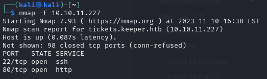

###### connexion au site 

![[Machine-Keeper-01.png]]
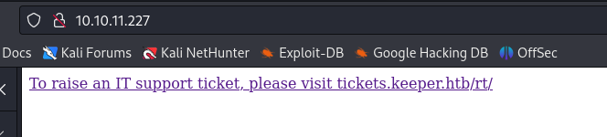


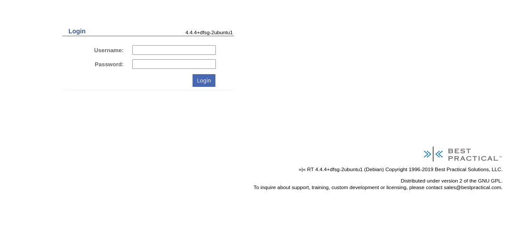

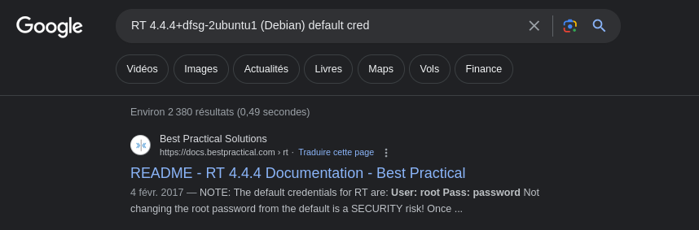

- chercher les users

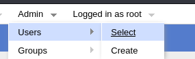

on a deux utilisateurs : 

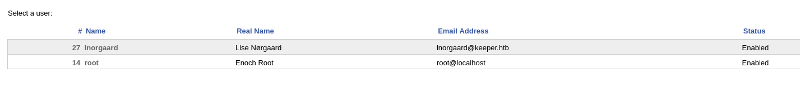
selectionnons le premier : 

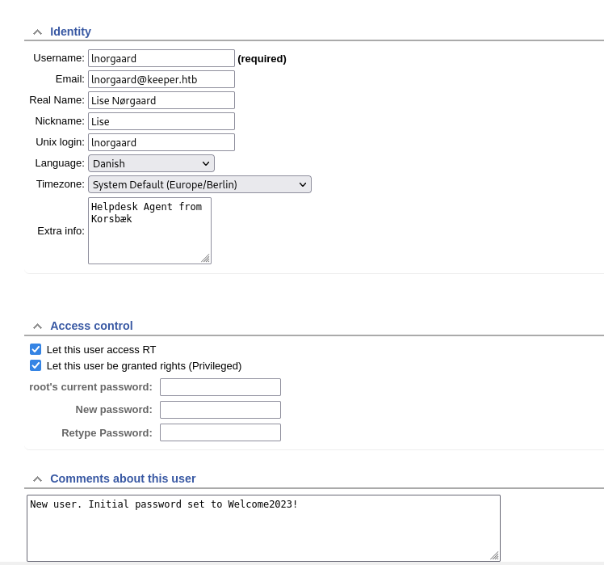

###### connexion via ssh

```bash
ssh lnorgaard@10.10.11.227
# password : Welcome2023!
```

###### User flag 

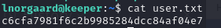

###### Exfiltrer le Fichier zip

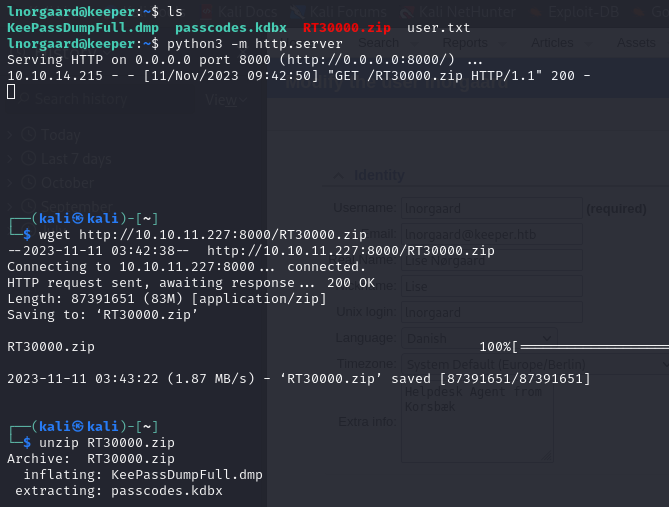
###### connaître le contenu du dump

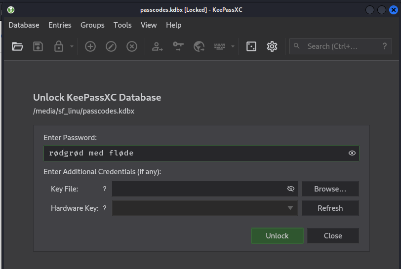
###### Ouvrir la db Keepass

après avoir cherché le mot sur  google translate, on peut récupérer les vrai lettres


###### Se connecter en tant que root et avoir le flag root
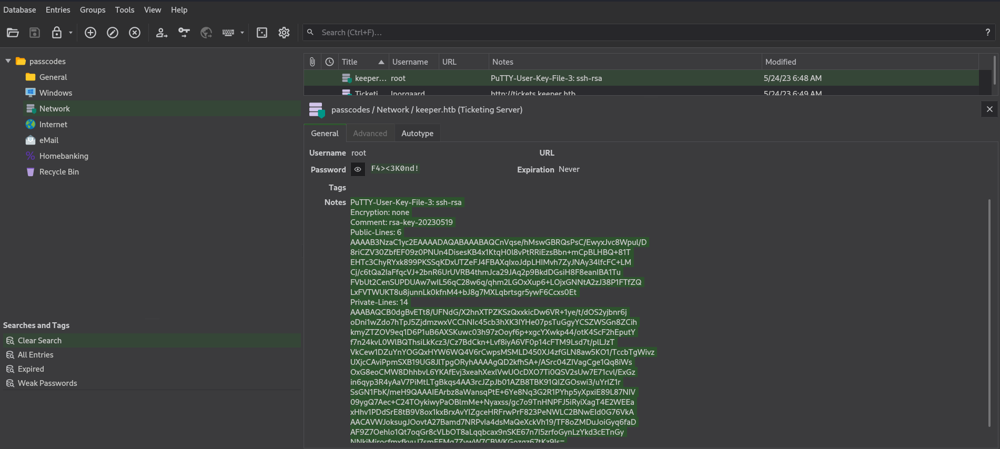

- copier le code dans un fichier ppk puis le convertir en fichier pem

```bash
sudo vim rsa_key.ppk
[sudo] password for kali: 
┌──(kali㉿kali)-[/media/sf_linu/keepass-dump-masterkey]
└─$ puttygen rsa_key.ppk -O private-openssh -o rootkey.pem

┌──(kali㉿kali)-[/media/sf_linu/keepass-dump-masterkey]
└─$ ssh -i rootkey.pem  root@10.10.11.227
Welcome to Ubuntu 22.04.3 LTS (GNU/Linux 5.15.0-78-generic x86_64)

 * Documentation:  https://help.ubuntu.com
 * Management:     https://landscape.canonical.com
 * Support:        https://ubuntu.com/advantage
Failed to connect to https://changelogs.ubuntu.com/meta-release-lts. Check your Internet connection or proxy settings

You have new mail.
Last login: Sat Nov 11 07:03:16 2023 from 10.10.16.18
root@keeper:~# ls
root.txt  RT30000.zip  SQL
root@keeper:~# cat root.txt 
9efe54f32d7ba678b04083b130d69026
```
